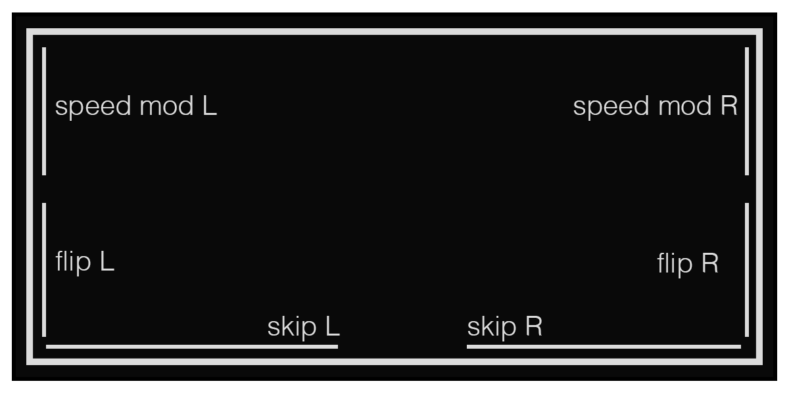

# bounds
delay/looper with probabilistic kinetic sequencing

the kinetic sequencer was coded by @enneff

_nb: bounds requires otis to be installed at dust/code/otis_

* key1 = shift
* key2 = add ball
* key3 = select ball
* shift + key2 = remove ball

* enc2 = rotate ball
* enc3 = ball speed
* shift + enc1 = probability
* shift + enc2/3 = feedback l/r

## balls

depending on your probability settings, when a ball collides with the edge of the screen an event will occur.
the nature of the event is determined by the x, y coordinates of the collision. the bounds are pictured bellow.

